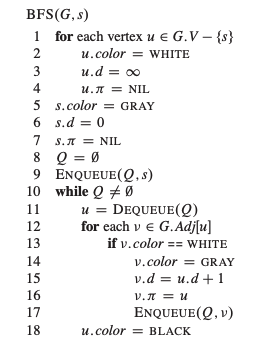

# Graph Algorithms

## Notes from Intro to Algorithms Book
 Chapters 22-26

### Representation of Graphs
- Two standard ways to represent graph `G = (V,E)`:
    - collection of adjancency lists
    - adjacency matrix

- **Adjacency-list** is usually method of choice
    - provides compact way to represent **sparse** graphs (those for which `|E|` is much less than `|V|^2`)
- **Adjacency matrix** preferred when graph is **dense**
    - When `|E|` is close to `|V|^2`
    - When we need to quickly tell if there is an edge connecting two given vertices
    - Space complexity: O(V²)

### Graph Implementation
```python
class Vertex:
    """Vertex with adjacency list as dictionary"""
    def __init__(self, key):
        self.id = key
        self.neighbors = {}  # neighbor_vertex -> weight

class Graph:
    """Graph using Vertex objects"""
    def __init__(self, directed=False):
        self.vertices = {}  # key -> Vertex object
        self.directed = directed
```

# Implemented Algorithms


## Breadth-first search
**Time Complexity:** O(V + E)  
**Space Complexity:** O(V)

### Algorithm Overview
- Systematically explores edges of G to discover every vertex reachable from source `s`
- Expands the frontier between discovered and undiscovered vertices uniformly across the breadth
    - Discovers all vertices at distance `k` from `s` before discovering any vertices at distance `k+1`

#### Vertex Coloring (Conceptual)
- **White**: Undiscovered vertices
- **Gray**: Discovered but not fully explored (frontier)
- **Black**: Fully explored (all neighbors discovered)
- to keep track, BFS-search colors each vertex: white, gray, or black
    - all vertices start out white
    - becomes non-white when vertex is discovered first time
    - vertex is black when all vertices adjacent to it have been discovered
    - gray vertices may have some adjacent white vertices



### Implementation Variants

##### 1. Basic BFS Traversal
```python
def bfs_basic(self, start_key) -> List:
    """Returns vertices in BFS order"""
    # Key insight: Mark as visited when ADDING to queue
    # This prevents duplicates in queue
```

##### 2. Level-wise BFS
```python
def bfs_with_levels(self, start_key) -> List[List]:
    """Groups vertices by distance from start"""
    # Returns: [['A'], ['B', 'C'], ['D', 'E', 'F'], ...]
    # Process all nodes at current level before next
```

##### 3. Shortest Distances
```python
def bfs_shortest_distances(self, start_key) -> Dict[str, int]:
    """Returns distance from start to all reachable vertices"""
    # BFS guarantees shortest path in unweighted graphs
```

##### 4. Shortest Path
```python
def shortest_path(self, start_key, end_key) -> Optional[List]:
    """Finds shortest path between two vertices"""
    # Uses parent pointers to reconstruct path
    # Early termination when target found
```

#### Key Insights
1. **Queue vs Stack**: BFS uses queue (FIFO) vs DFS uses stack (LIFO)
2. **When to mark visited**: Always mark when adding to queue, not when processing
3. **Level boundaries**: `len(queue)` at start of iteration = nodes at current level
4. **Path reconstruction**: Track parent pointers, then walk backwards
5. **Shortest path property**: BFS finds shortest path in **unweighted** graphs

#### Applications
- Shortest path in unweighted graphs
- Finding connected components
- Testing bipartiteness
- Level-order traversal in trees
- Web crawling (limited depth)
- Social network analysis (degrees of separation)
- Puzzle solving (finding minimum moves)

## Dijkstra's Algorithm (weighted graphs)

### Algorithm Overview
- Solves single-source shortest-paths problem on a weighted, directed graph G = (V,E)
    - All edge weights must be non-negative
- Dijkstra's tells us **shortest path from one node to every other node**
- Greedy algorithm that builds up shortest paths in order of increasing distance from source

### Core Concept
Dijkstra's algorithm grows a "cloud" of vertices with known shortest paths, expanding outward from the source by always choosing the closest unprocessed vertex.

### Algorithm Mechanics

#### Data Structures
- **Set S**: Vertices whose final shortest-path weights from source `s` have been determined
- **Priority Queue Q**: Vertices in `V-S`, keyed by their current distance estimates
- **dist[v]**: Current shortest known distance from source to vertex v
- **parent[v]**: Previous vertex on shortest path (for path reconstruction)

#### The Relaxation Operation
Central to shortest path algorithms - attempts to improve the shortest path to a vertex:

Goal of Relaxation: When processing a vertex, check if going through this vertex offers a shorter path to each of its neighbors than currently known.

```
RELAX(u, v, weight):
    if dist[u] + weight(u,v) < dist[v]:
        dist[v] = dist[u] + weight(u,v)
        parent[v] = u
```
This asks: "Is the path to v through u shorter than the current known path to v?"

What this means:

For each neighbor v of current vertex u
Calculate: "What would the distance be if I went to v through u?"
If this path is shorter than the currently known path to v, update v's distance
This propagates shortest distances outward from the source

Why "Relaxation"? The term comes from "relaxing" or "loosening" the distance constraints - if we find a better path, we update our estimate to this improved value.

### Detailed Algorithm Steps

#### 1. Initialization
```
- Set dist[s] = 0 (source has distance 0 to itself)
- Set dist[v] = ∞ for all other vertices v
- Set parent[v] = NULL for all vertices
- Add all vertices to priority queue Q
```

#### 2. Main Loop
```
while Q is not empty:
    u = EXTRACT-MIN(Q)  // Vertex with minimum distance
    Add u to S          // Mark as processed
    
    for each neighbor v of u:
        RELAX(u, v, weight(u,v))
        if distance was improved:
            DECREASE-KEY(Q, v, new_distance)
```

#### 3. Termination
- Algorithm terminates when Q is empty
- All reachable vertices now have correct shortest distances in dist[]
- Can terminate early if only need path to specific target

### Why It Works

#### The Greedy Property
When we extract vertex `u` with minimum distance from Q, that distance is guaranteed to be the shortest possible path from source to u.

**Proof Intuition:**
1. Assume u has minimum distance d among unprocessed vertices
2. All other unprocessed vertices have distance ≥ d
3. All edges have non-negative weights
4. Therefore, any path to u through another unprocessed vertex would have length ≥ d
5. So the current distance to u must be optimal

#### Algorithm Invariant
**At the start of each iteration:**
- For all vertices in S, dist[v] = δ(s,v) (the true shortest path distance)
- For all vertices in Q, dist[v] is the shortest path using only vertices in S as intermediates

### Critical Implementation Details

#### Why Non-Negative Weights Are Required
With negative edges, a vertex we've already processed might later get a shorter path through vertices we haven't seen yet, breaking the greedy assumption.

**Example of failure with negative edge:**
```
    1      -3
s ----> a ----> b
 \             /
  \___________/
        2
```
Dijkstra's would assign dist[b] = 2, but the true shortest path s→a→b has length -2.

#### The Visited Check
Once a vertex is extracted from the priority queue with minimum distance, we never need to process it again - its shortest path is finalized.

#### Priority Queue Duplicates
In implementations using binary heap:
- A vertex might exist in queue multiple times with different distances
- The visited check ensures we only process the first (shortest) occurrence
- Alternative: use indexed priority queue with decrease-key operation

### Implementation Tips
1. Use visited set to avoid reprocessing vertices
2. Can use simple array instead of heap for dense graphs
3. For single destination, can stop early when target is reached
4. Store parent pointers during relaxation fo

# To Implement

### Depth-First Search (DFS)
- [ ] Recursive and iterative implementations
- [ ] Cycle detection
- [ ] Topological sort
- [ ] Connected components

### Shortest Path Algorithms
- [ ] Dijkstra's Algorithm (weighted graphs)
- [ ] Bellman-Ford (negative edges)
- [ ] Floyd-Warshall (all-pairs)

### Minimum Spanning Trees
- [ ] Kruskal's Algorithm
- [ ] Prim's Algorithm

### Advanced
- [ ] Strongly Connected Components (Kosaraju/Tarjan)
- [ ] Articulation Points & Bridges
- [ ] Network Flow (Ford-Fulkerson)